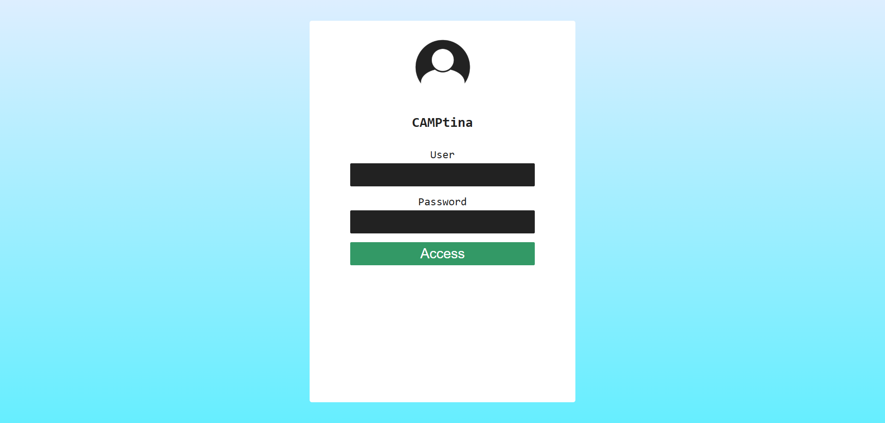
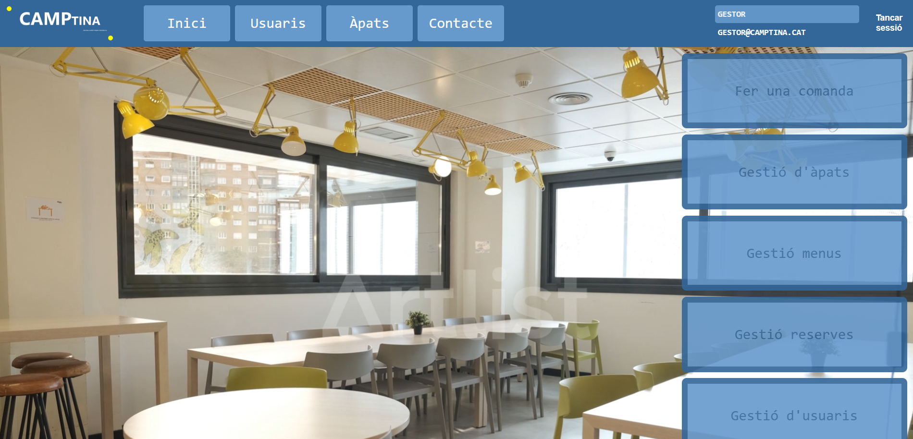
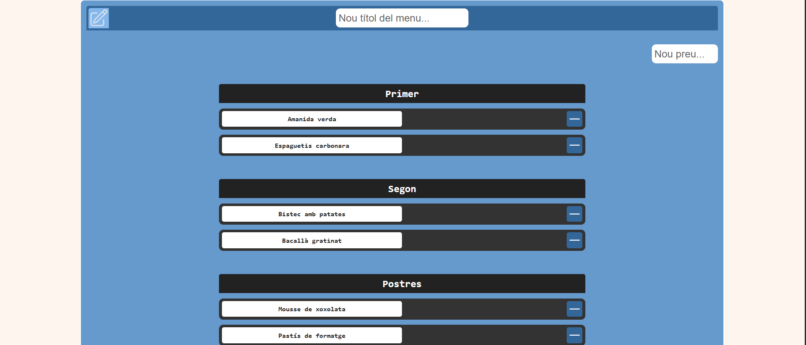
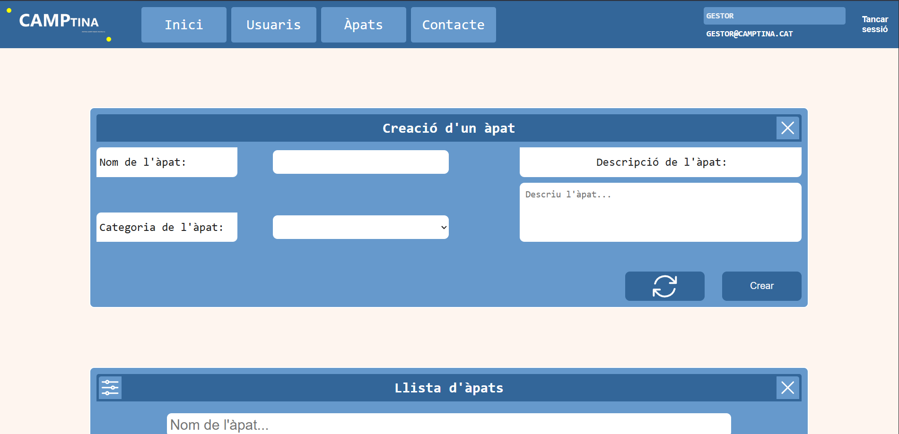

# CAMPtina

CAMPtina is a web application for managing a company canteen, developed as a final project for a Higher Degree in Web Application Development (DAW). It allows employees to select their daily menu (starter, main course and dessert), choose a meal shift, and manage their bookings through secure authentication. It also includes an administration panel for creating and managing users, dishes, menus and shifts.

## Screenshots

<table>
  <tr>
    <td></td>
    <td></td>
  </tr>
  <tr>
    <td></td>
    <td></td>
  </tr>
</table>

## Tech Stack


- State: Context API
- Authentication: JWT (JSON Web Tokens)

## Features

- Authentication system with secure login
- Role-based access control (user/administrator)
- Private routes protected by permissions
- Daily menu selection (appetizer, main course, dessert)
- Meal shift management
- Admin panel for user CRUD operations

## Getting Started

### Prerequisites

- [Java 21](https://www.oracle.com/java/technologies/downloads/#java21)
- [MySQL 8.0+](https://dev.mysql.com/downloads/mysql/)
- [Node.js](https://nodejs.org/)

### Installation

1. Clone the repository
   ```bash
   git clone https://github.com/MikelSL9/CAMPtina.git
   ```

2. Set up the database
   - Start your MySQL server
   - Create the database by running the provided SQL file:
   ```bash
   mysql -u root -p < Recursos/crearBBDDcamptina.sql
   ```

3. Run the backend
   - Open `CAMPtina_Backend` in your IDE (IntelliJ IDEA, Eclipse or VSCode)
   - Run the main class `CamPtinaBackendApplication`

4. Run the frontend
   ```bash
   cd CAMPtina_frontend/projecte-camptina
   npm install
   npm run dev
   ```

5. Open your browser at `http://localhost:5173`

## Default Credentials

| Role    | Email                  | Password |
|---------|------------------------|----------|
| Admin   | gestor@camptina.cat    | 12345    |

## Usage

### As Admin
1. **Manage users** — Go to *Gestió Usuaris* to create new users (admin or worker roles)
2. **Manage dishes** — The database includes predefined dishes. New ones can be added from the admin panel
3. **Manage menu** — Go to *Gestió Menús* to add dishes to the daily menu (one menu supported, up to 3 dishes per category: starter, main course and dessert)
4. **Manage shifts** — 3 shifts are predefined in the database
5. **Manage bookings** — View, edit or delete any worker booking

### As Worker
1. Go to *Menú Inici* and select your dishes and shift
2. Confirm your booking — you will be automatically redirected after
3. You can cancel your booking at any time

## Team

Project developed by a team of 4 people as a final project for the Higher Degree in Web Application Development (DAW), 2025.

### My Role
Responsible for **frontend development, authentication, and API integration**:
- **Authentication and login system**: Full development of the login flow in React
- **Role-based private routes**: Implementation of route protection based on user type (differentiated access between standard users and administrators)
- **React components**: Development of components to manage shifts and dishes
- **State management**: Implementation of Context API for global state and session management
- **API-Frontend integration**: Full connection to the backend using Axios
- **Backend**: Management of Java classes related to users and data
